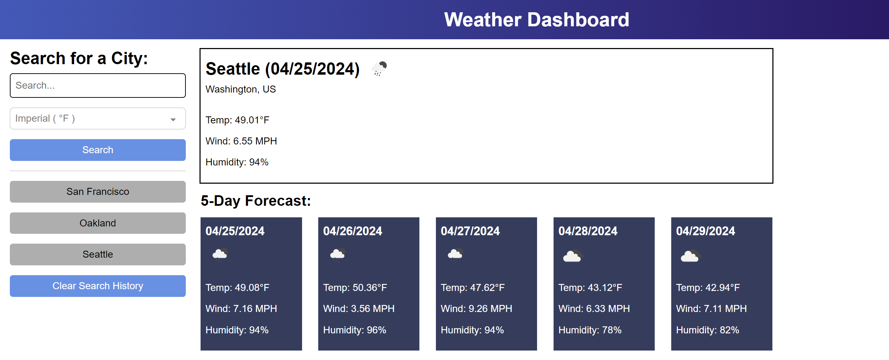

# weather-dashboard

## Project Description

A study in creating a weather dashboard application utilizing server-side APIs and localStorage.

## Contents

- [Introduction](#introduction)
- [Problem](#problem)
- [Solution](#solution)
- [Usage](#usage)
- [Deployment](#deployment)
- [Collaborators](#collaborators)
- [License](#License)

## Introduction

For this project I set out to create a functional weather forecast application that utilized OpenWeatherMap API data, allowing users to search for any known city and be provided with its current weather conditions and a 5-day forecast. A search history sidebar also allows users to quickly check the weather for any city they have already searched for.

## Problem

I was given the following project requirements by the client:

- GIVEN a weather dashboard with form inputs
- WHEN I search for a city
- THEN I am presented with current and future conditions for that city and that city is added to the search history
- WHEN I view current weather conditions for that city
- THEN I am presented with the city name, the date, an icon representation of weather conditions, the temperature, the humidity, and the the wind speed
- WHEN I view future weather conditions for that city
- THEN I am presented with a 5-day forecast that displays the date, an icon representation of weather conditions, the temperature, the wind speed, and the humidity
- WHEN I click on a city in the search history
- THEN I am again presented with current and future conditions for that city

Project mockup image:

## Solution

I addressed the above problems in the following way:

- Built and styled HTML to match mockup provided by the client.
- Used JavaScript to call and handle information from the OpenWeatherMap API.
- Used JavaScript to dynamically render and update HTML.
- Integrated LocalStorage handling of user search history that updates HTML when changed.
- Added extra features including a measurement unit selector and a clear search history button.

See below for a screenshot of the project:

## Usage

To see a weather forecast for most known cities worldwide, enter a city's name in the search bar on the left. The measurement units will default to imperial if none are selected, but you may use the dropdown beneath the search bar to select metric instead if desired. To view the weather for a city you have already searched for, simply select its name from the history section beneath the search button. To clear the search history simply press the clear history button at the bottom of the list.

## Deployment

[Link to the GitHub repo for this project](https://github.com/Aoliva96/weather-dashboard)

[Link to the deployed project on GitPages](https://aoliva96.github.io/weather-dashboard)

## Collaborators

I collaborated with my bootcamp instructors John Young and Nick Gambino.
I also utilized the EdX Xpert Learning Assistant tool for efficiency refactoring, code concepts, and syntax suggestion.

## License

This project utilizes the standard MIT License.
